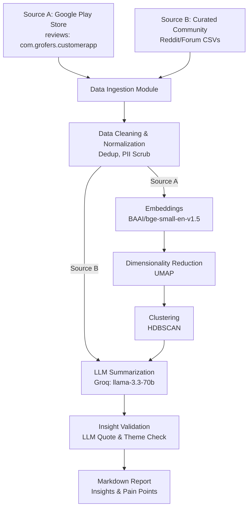

# Blinkit Category Discovery Engine — Architecture

This document outlines the architecture for the AI-Powered Discovery Engine designed to analyze user feedback for Blinkit (Phase 1). The pipeline is a localized, python-based data processing workflow that ingests, cleans, clusters, and summarizes user feedback from dual sources to uncover insights on category discovery and shopping habits.

## 1. High-Level Architecture

The pipeline operates in a sequential flow, transforming raw text from diverse sources into a structured, PM-ready markdown report. It uses a **DUAL-SOURCE** approach.

## 2. Component Breakdown

### A. Data Ingestion (Gather)
- **Source A (Google Play Store Adapter)**: Connects to the Play Store via `google-play-scraper`. Targets the app ID `com.grofers.customerapp`, fetching the most recent (~10,000) reviews in English from the India region.
- **Source B (Community CSVs)**: Ingests pre-curated community/Reddit/forum comments that have been manually researched (e.g., via Gemini/ChatGPT deep research) and saved as CSV files.

### B. Data Cleaning (Normalize)
- **Deduplication**: MD5 hashing of normalized text (lowercase, stripped whitespace) ensures identical reviews or spammed text are processed only once. For Source B, deduplication also considers the source URL.
- **PII Scrubbing**: Regex-based redaction of phone numbers, email addresses, and UPI IDs to ensure privacy compliance.
- **Noise Filtering**: Removes very short reviews (<15 characters) that lack semantic value (e.g., "nice app", "good").

### C. Analysis Engine (Embed → Cluster) *[Source A Only]*
The core ML pipeline identifies emergent themes from unstructured Play Store reviews without relying on predefined keywords. (Source B skips this step as it is already pre-curated for discovery intent).
- **Embeddings**: Uses `sentence-transformers` with the `BAAI/bge-small-en-v1.5` model. This runs locally and converts each review into a 384-dimensional dense vector representing its semantic meaning.
- **Dimensionality Reduction**: Uses `UMAP` (Uniform Manifold Approximation and Projection) to reduce the 384-dimensional space down to 5 dimensions, making the data suitable for density-based clustering. Uses cosine similarity as the metric.
- **Clustering**: Uses `HDBSCAN` (Hierarchical Density-Based Spatial Clustering of Applications with Noise). Groups similar reviews into distinct themes and isolates outliers as noise (-1). The clusters are ranked based on a composite score of size, rating severity, and recency.

### D. Insight Generation (Summarize & Validate)
- **LLM Summarization**: The top clusters from Source A and the batched comments from Source B are sent to the Groq API (using `llama-3.3-70b-versatile`). A custom system prompt directs the LLM to focus on *why users stick to habitual categories, trust signals, and discovery friction*. The LLM outputs a structured JSON containing a theme name, summary, pain points, action ideas, and representative quotes.
- **Validation**:
  1. **Quote Validation**: Enforces that all LLM-generated quotes are verbatim substrings from the source texts to prevent hallucination.
  2. **Theme Validation**: Samples raw, full-text snippets from each cluster/batch and asks the LLM to independently verify if those texts match the assigned theme, assigning a confidence score.

### E. Reporting (Output)
- **Markdown Renderer**: Formats the validated insights into a clean, easy-to-read markdown file. It includes an executive summary, detailed breakdowns per cluster/theme (with valid quotes and URLs for Source B), and a data health/noise section.

## 3. Tech Stack

- **Language**: Python 3.11+
- **Data Gathering**: `google-play-scraper`, standard `csv`
- **NLP / ML**: `sentence-transformers` (Embeddings), `umap-learn` (Reduction), `hdbscan`, `scikit-learn` (Clustering)
- **LLM Provider**: `groq` API (using `llama-3.3-70b-versatile` for high-speed, cost-effective inference)
- **Data Models**: `pydantic` (for robust data validation across pipeline boundaries)

## 4. Scope Boundaries

As defined in Phase 1:
- This is a localized, one-off execution script (CLI driven).
- There is no web dashboard, no database persistence (other than raw JSON/CSV caches), and no automated delivery (e.g., Gmail/Slack/Google Docs).
- Focus is strictly on dual-source ingestion and insight extraction to guide product strategy.
